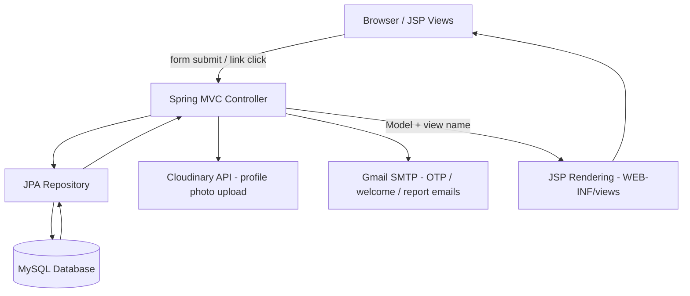

# MoneyTrail

A web-based personal expense and income tracker built with Spring Boot, JSP, and MySQL — with separate admin and user dashboards, income/expense tracking against accounts, category-wise breakdowns, and email-based reports.

## 2. Project Overview

MoneyTrail is a full-stack personal finance management web application. It lets a user record income and expenses against named accounts (e.g. "Cash", "Bank"), organize transactions by category, sub-category, and vendor, and see where their money is going through charts and reports.

The application solves the everyday problem of tracking personal cash flow: knowing how much was earned and spent in a given month or quarter, which categories are consuming the most money, and what the resulting profit/loss looks like — without needing a spreadsheet.

It is built for two kinds of users:
- **Admins**, who manage the master data of the system (users, accounts, categories, sub-categories, vendors, statuses) and see an aggregate dashboard.
- **Regular users**, who log their own income and expenses, view their own dashboard/reports, and manage their own profile.

The core idea is a classic server-rendered CRUD application: Spring MVC controllers backed by JPA repositories, rendering JSP views, with account balances updated automatically whenever an income or expense entry is saved.

## 3. Key Features

- **User authentication** — Sign up, sign in, and logout using session-based authentication (`SessionController`). Passwords are hashed with Spring Security's `PasswordEncoder` before being stored.
- **Role-based access (Admin vs User)** — The `role` field on each user (`ADMIN` / `USER`) determines which dashboard and view set they're routed to after login.
- **Forgot password via OTP email** — A user can request a one-time password sent to their email (`UserService.generateAndSendOtp`), verify it, and set a new password within a 5-minute expiry window.
- **Account management** — Create, edit, delete, and list financial accounts (e.g. bank, cash) with a running balance (`AccountEntity`).
- **Income & expense tracking** — Add, edit, delete, and view income/expense entries, each linked to a category, sub-category, vendor, account, and status. Saving an expense checks the source account's balance and blocks the transaction if funds are insufficient; saving an income or expense automatically adjusts the linked account's balance.
- **Category & sub-category management** — Organize transactions hierarchically (category → sub-category) for both admin master data and per-transaction tagging.
- **Vendor management** — Track vendors/payees associated with expenses.
- **Status management** — A configurable status list (e.g. paid/pending) attachable to income and expense entries.
- **Dashboards with charts** — Both the admin dashboard and the user dashboard compute this-month and this-quarter income/expense totals, plus monthly and category-wise breakdowns serialized to JSON for chart rendering in the JSP views.
- **Reports (Expense, Income, Category, Profit/Loss)** — Per-user reports with optional date-range filtering, including a 12-month profit/loss trend (`ReportController`).
- **Email reports** — A user can trigger an HTML-formatted report email (expense, income, or profit/loss) sent to their own address via Gmail SMTP.
- **Profile management with photo upload** — Users and admins can update their profile (name, email, gender, birth year, contact number) and upload a profile picture, stored via Cloudinary.
- **Session-based route protection** — A servlet `Filter` (`AuthFilter`) blocks access to all non-public routes unless a user is logged in, redirecting to `/login` otherwise.

## 4. How the Project Works



A typical flow (e.g. adding an expense):

1. The logged-in user opens the "Add Expense" form (`ExpenseController#expense`), which is pre-populated with dropdown data (categories, sub-categories, vendors, accounts, statuses) fetched from the database.
2. On submit, `ExpenseController#saveExpense` receives the form-bound `ExpenseEntity`, attaches the logged-in user's ID from the session, and looks up the selected account.
3. If the account has sufficient balance, the expense amount is deducted from the account and both the account and the new expense are saved; otherwise the user is redirected back with an `insufficient` error flag.
4. The user is redirected to `/expenseList`, which queries only that user's expenses and renders `ExpenseList.jsp`.

Dashboards follow a similar pattern: the controller aggregates the logged-in user's income/expense records with Java Streams (grouping by month and by category), serializes the results to JSON with Jackson, and passes them into the JSP so client-side chart libraries can render them.

## 5. Technology Stack

**Backend**
- Java 17
- Spring Boot 4.0.2 (`spring-boot-starter-data-jpa`, `spring-boot-starter-webmvc`)
- Spring Security Crypto — password hashing only (no full Spring Security filter chain is configured; access control is done via the custom `AuthFilter`)
- Hibernate / Spring Data JPA — ORM against MySQL, with `ddl-auto=update` for schema management

**View Layer**
- JSP (JavaServer Pages) with JSTL, rendered from `/WEB-INF/views`
- Bootstrap-based static CSS/JS front end (`src/main/resources/static`)

**Database**
- MySQL (`mysql-connector-j`), connected via `spring.datasource.*` in `application.properties`

**APIs & Services**
- Cloudinary (`cloudinary-http44`) — profile picture hosting
- Gmail SMTP via `spring-boot-starter-mail` — welcome emails, OTP emails, password-reset confirmation emails, and on-demand report emails (HTML, built directly in `ReportController`/`MailService`)

**Deployment**
- Packaged as a WAR (`spring-boot-starter-tomcat` as `provided`), deployable to an external servlet container
- Dockerfile with a two-stage build (Maven build stage + `alpine/java:21-jdk` runtime stage)

**Development Tools**
- Maven (with the `mvnw` wrapper)
- Spring Boot DevTools (hot reload during development)

## 6. Project Structure

```text
MoneyTrail/
├── Dockerfile                  # Two-stage Docker build (Maven build → JDK runtime)
├── pom.xml                     # Maven dependencies and build config
├── mvnw / mvnw.cmd              # Maven wrapper scripts
├── HELP.md                     # Default Spring Initializr reference doc
├── README.md
└── src/
    ├── main/
    │   ├── java/com/
    │   │   ├── MoneyTrailApplication.java     # Spring Boot entry point
    │   │   ├── ServletInitializer.java        # WAR deployment support
    │   │   └── grownited/
    │   │       ├── controller/                # All Spring MVC controllers
    │   │       ├── entity/                    # JPA entities (Account, Category, Expense, Income, Status, SubCategory, Vender, userEntity)
    │   │       ├── repository/                # Spring Data JPA repositories
    │   │       ├── filter/AuthFilter.java      # Session-based route guard
    │   │       └── service/                   # MailService, UserService (OTP logic)
    │   ├── resources/
    │   │   ├── application.properties         # DB, mail, server, upload config
    │   │   ├── static/                        # CSS, JS, images, Bootstrap assets
    │   │   └── templates/                     # HTML email templates (welcome, OTP, reset confirmation)
    │   └── webapp/WEB-INF/views/               # JSP pages (admin views + USER/ subfolder for user-facing views + reports/)
    └── test/java/                              # Test sources (scaffold only)
```

- **`controller/`** — One controller per domain area (Account, Category, SubCategory, Vender, Status, Expense, Income, User, Report, Session) plus `DashboardController` (admin dashboard), `UserDashboardController` (user-side CRUD + profile), and `GlobalController` (a `@ControllerAdvice` that computes the "active page" name for navigation highlighting on every request).
- **`entity/`** — Plain JPA entities mapped to MySQL tables (`users`, `expense`, and similarly named tables for income, account, category, sub-category, vendor, status).
- **`repository/`** — Spring Data JPA interfaces; several include custom `@Query`-style aggregate methods (e.g. totals by user/month/quarter).
- **`filter/AuthFilter.java`** — Intercepts every request; allows a small whitelist of public URLs (login, signup, forgot-password, static assets, `/api`, `/register`, `/changePassword`) through, and redirects everything else to `/login` if no user is in the session.
- **`webapp/WEB-INF/views/USER/`** — The user-facing JSP set, separate from the admin JSP set at the top level of `views/`.
- **`webapp/WEB-INF/views/USER/reports/`** — Category, Expense, Income, and Profit/Loss report JSPs.

## 7. Detailed Architecture

- **Entry point**: `MoneyTrailApplication` (standard `@SpringBootApplication`); `ServletInitializer` extends `SpringBootServletInitializer` so the WAR can also be deployed to an external Tomcat.
- **Request flow**: Browser → `AuthFilter` (session check) → Spring `DispatcherServlet` → Controller → Repository (JPA/Hibernate) → MySQL, with the controller then selecting a JSP view name resolved via `spring.mvc.view.prefix`/`suffix` in `application.properties`.
- **State management**: Server-side only, via `HttpSession` — the logged-in `userEntity` is stored in the session under the key `"user"` and re-fetched from the DB on demand (e.g. on profile page load) to keep it fresh.
- **Data flow for money movement**: Saving an `IncomeEntity` increases the linked `AccountEntity.amount`; saving an `ExpenseEntity` decreases it (after a balance check). This keeps account balances in sync without a separate ledger/audit table.
- **Authentication flow**: Plain email/password login checked against a BCrypt-style hash via `PasswordEncoder.matches`; no OAuth/JWT/session-token scheme is used — it's classic HTTP session authentication.
- **Email flow**: `MailService` loads HTML templates from `src/main/resources/templates/`, performs simple `${placeholder}` string replacement, and sends via `JavaMailSender` (Gmail SMTP). `ReportController` additionally builds report HTML inline (not from a template file) for the "send report by email" feature.
- **File upload flow**: Profile picture uploads (`MultipartFile`) are streamed directly to Cloudinary; the returned `secure_url` is stored on the user entity — no local file storage is used.
- **Cross-cutting navigation state**: `GlobalController` (a `@ControllerAdvice`) inspects the request URI on every call and injects an `activePage` model attribute used by the JSP layout to highlight the current nav item.

## 8. Installation and Setup

### Prerequisites
- Java 17 (JDK)
- Maven (or use the included `mvnw` wrapper — no separate Maven install required)
- MySQL Server (running locally or reachable)
- A Cloudinary account (for profile picture uploads)
- A Gmail account with an [App Password](https://support.google.com/accounts/answer/185833) (for SMTP email)

### Steps

1. **Clone/download the project** and open the `MoneyTrail/` folder.

2. **Create the database** in MySQL:
   ```sql
   CREATE DATABASE moneytrail;
   ```
   Tables are created/updated automatically by Hibernate (`spring.jpa.hibernate.ddl-auto=update`) on first run.

3. **Configure `src/main/resources/application.properties`** with your own database credentials, mail credentials, and Cloudinary credentials (see [Environment Variables](#9-environment-variables) below — the current file has real-looking values checked in that you should replace).

4. **Install dependencies and build**:
   ```bash
   ./mvnw clean install
   ```

5. **Run the application**:
   ```bash
   ./mvnw spring-boot:run
   ```
   or run the packaged WAR:
   ```bash
   java -jar target/MoneyTrail-1.war
   ```

6. **Access the app** at `http://localhost:9898/` (port is set in `application.properties`).

### Docker (alternative)

A two-stage `Dockerfile` is provided:
```bash
docker build -t moneytrail .
docker run -p 8080:8080 moneytrail
```
> Note: the Dockerfile's `COPY --from=builder` step references `/app/target/CodeVerse-1.war`, which does not match this project's actual artifact name (`MoneyTrail-1.war` per `pom.xml`). This will need to be corrected before the Docker build will succeed — see [Current Limitations](#14-current-limitations).

## 9. Environment Variables

MoneyTrail does not use OS-level environment variables — configuration lives in `src/main/resources/application.properties`. The checked-in file currently contains real-looking credentials; treat the values below as placeholders to replace with your own before deploying:

```properties
# Database
spring.datasource.url=jdbc:mysql://localhost:3306/moneytrail
spring.datasource.username=your_db_username
spring.datasource.password=your_db_password

# Gmail SMTP (use an App Password, not your normal Gmail password)
spring.mail.username=your_gmail_address@gmail.com
spring.mail.password=your_gmail_app_password
```

Additionally, Cloudinary credentials are required for the `Cloudinary` bean used by upload features (the credentials are not present in `application.properties` in the current codebase — a `Cloudinary` bean/configuration class providing `cloud_name`, `api_key`, and `api_secret` must be supplied for uploads to work).

| Variable | Purpose | Required |
|---|---|---|
| `spring.datasource.url/username/password` | MySQL connection | Yes |
| `spring.mail.username/password` | Sends welcome, OTP, password-reset, and report emails | Yes |
| Cloudinary credentials | Profile picture upload | Yes, for photo upload features |

## 10. Usage Guide

1. Open the application at `http://localhost:9898/`.
2. **Sign up** for a new account (`/signup`) with a profile picture — new sign-ups default to the `USER` role.
3. **Sign in** (`/login`) — admin accounts are routed to `/adminDashboard`, regular users to `/Home`.
4. As a user: add **Accounts** first (so income/expense entries have somewhere to post to), then record **Income** and **Expenses**, tagging each with category/sub-category/vendor/status as needed.
5. View the **Dashboard** for a monthly/quarterly income vs. expense summary and category breakdown chart.
6. Open **Reports** to view Expense, Income, Category, or Profit/Loss reports, optionally filtered by date range.
7. Use **Send Report by Email** to receive a formatted HTML report at your registered email address.
8. Update your **Profile** (including profile photo) at any time.
9. If you forget your password, use **Forgot Password** to receive an OTP by email, verify it, and set a new password.

## 11. Important Components and Modules

| Component | Purpose |
|---|---|
| `SessionController` | Handles signup, login/authenticate, logout, forgot/reset password (OTP flow), and profile updates for admins |
| `UserDashboardController` | User-side dashboard plus CRUD for the logged-in user's accounts, expenses, and income; also serves the user profile page |
| `ExpenseController` / `IncomeController` | CRUD for expense/income entries, including the account-balance adjustment logic |
| `AccountController`, `CategoryController`, `SubCategoryController`, `VenderController`, `StatusController` | CRUD for master/reference data used across transactions |
| `ReportController` | Builds date-filtered Expense, Income, Category, and Profit/Loss reports, and sends them by email |
| `DashboardController` | Admin dashboard: aggregate monthly/quarterly totals and category chart data |
| `AuthFilter` | Servlet filter enforcing that only whitelisted URLs are reachable without a session user |
| `MailService` | Loads HTML email templates and sends welcome/OTP/reset-confirmation emails via Gmail SMTP |
| `UserService` | Generates, stores, and verifies password-reset OTPs (5-minute expiry) |
| `GlobalController` | `@ControllerAdvice` that injects the current "active page" name into every model, for nav highlighting |

## 12. API Documentation

MoneyTrail does not expose a JSON/REST API. All endpoints are traditional Spring MVC controller routes that either render a JSP view or issue a redirect; form submissions use standard `application/x-www-form-urlencoded` / `multipart/form-data` POST requests. Representative routes include:

| Method | Route | Purpose | Auth Required |
|---|---|---|---|
| GET | `/login` | Show login page | No |
| POST | `/authenticate` | Authenticate user, start session | No |
| POST | `/register` | Create a new user account | No |
| GET | `/logout` | Invalidate session | Yes (implicitly) |
| POST | `/sendOtp` | Send password-reset OTP | No |
| POST | `/ResetPassword` | Verify OTP | No |
| POST | `/resetPassword` | Set new password | No |
| GET/POST | `/expense`, `/saveExpense` | Show form / save a new expense | Yes |
| GET | `/expenseList`, `/viewExpense`, `/editExpense`, `/deleteExpense` | List/view/edit/delete expenses | Yes |
| GET/POST | `/income`, `/saveIncome` | Show form / save a new income entry | Yes |
| GET | `/incomeList`, `/viewIncome`, `/editIncome`, `/deleteIncome` | List/view/edit/delete income | Yes |
| GET | `/profitloss`, `/sendMail` | Profit/loss report, email a report | Yes |

The one `@ResponseBody` endpoint is `GET /sendMail`, which returns a plain `"success"` or `"error:<message>"` string rather than a structured JSON response.

## 13. Screenshots or Visual Documentation

No screenshots, renders, or diagrams were found in the uploaded files. Static image assets present are UI decoration only (`static/img/default.jpg`, `testimonial-1.jpg`, `testimonial-2.jpg`, `user.jpg`) and are not representative product screenshots.

## 14. Current Limitations

- **Credentials committed to source control**: `application.properties` contains a real-looking database password and a Gmail app password in plain text. These must be rotated and externalized (e.g. environment variables or a secrets manager) before any real deployment.
- **Dockerfile artifact name mismatch**: The Dockerfile copies `target/CodeVerse-1.war`, but the Maven build (per `pom.xml`, `artifactId=MoneyTrail`, `version=1`) produces `MoneyTrail-1.war`. The Docker build will fail as-is.
- **No Cloudinary configuration found**: The `Cloudinary` bean is `@Autowired` in several controllers, but no corresponding `@Configuration` class or property entries were found in the uploaded files — this needs to be added for photo upload to work.
- **Duplicated/overlapping logic**: `DashboardController#adminDashboard` and `SessionController#openHome` contain near-identical dashboard-aggregation code; `IncomeController` and portions of `UserDashboardController` also duplicate income CRUD logic.
- **Route/HTTP-verb quirk**: `UserDashboardController` defines `@GetMapping("/userDelete Income")` — a route containing a literal space — which is very likely a typo and would be awkward or impossible to link to correctly from a browser.
- **No CSRF protection**: No Spring Security filter chain is configured, so state-changing POST endpoints have no CSRF token protection.
- **No automated tests**: The `src/test/java` folder exists with the default Spring Boot test scaffold only; no meaningful test coverage was found.
- **Some edit routes are commented out**: Several controllers contain commented-out earlier versions of edit endpoints alongside the current working versions.
- **No pagination**: List views (`expenseList`, `incomeList`, `userList`, etc.) load and render the full result set with no paging.
- **JSP/WAR-based stack**: Requires deployment as a WAR to a servlet container (or embedded Tomcat via `provided`-scope `spring-boot-starter-tomcat`, which needs adjusting to run standalone) — this is an older architectural style compared to a modern SPA + REST API split.

## 15. Future Improvements

Currently implemented: full income/expense/account/category/vendor/status CRUD, session auth, OTP password reset, dashboards with charts, date-filtered reports, and report-by-email.

Potential future improvements (not currently implemented):
- Externalize all secrets via environment variables and remove them from source control.
- Fix the Dockerfile artifact name and add environment-based configuration for containerized deployments.
- Add a proper `Cloudinary` configuration bean/property set.
- Replace session-based JSP rendering with a REST API + modern front-end, or add Spring Security for CSRF/role-based authorization.
- Add automated unit/integration tests.
- Add pagination and search/filtering to list views.
- Consolidate duplicated dashboard/income logic between controllers.

## 16. Troubleshooting

- **App fails to connect to the database**: Confirm MySQL is running, the `moneytrail` database exists, and `spring.datasource.url/username/password` in `application.properties` are correct.
- **Emails are not sending**: Gmail SMTP requires an **App Password** (not your regular password) and 2-Step Verification enabled on the Google account; also confirm outbound port 587 isn't blocked by your network/firewall.
- **Profile picture upload fails / throws an exception**: This indicates the `Cloudinary` bean isn't configured (see [Current Limitations](#14-current-limitations)) — add your Cloudinary `cloud_name`, `api_key`, and `api_secret`.
- **Port 9898 already in use**: Change `server.port` in `application.properties`.
- **Docker build fails at the final `COPY` step**: The artifact filename in the Dockerfile doesn't match the actual build output — update it to `MoneyTrail-1.war` (or rename via `<finalName>` in `pom.xml`).
- **JSP pages not rendering / blank pages**: Ensure the app is running as a WAR-compatible deployment (JSPs under `/WEB-INF/views` require the Tomcat Jasper/JSTL dependencies already declared in `pom.xml`; running via `java -jar` on the built WAR should work since `spring-boot-starter-tomcat` is present at `provided` scope for the build, but embedded JSP support can be finicky — deploying to an external Tomcat is the more reliable path).

## 17. Contributing

No contribution guidelines were found in the uploaded files. If you'd like to contribute, consider opening an issue or pull request describing the change, and follow the existing package structure (`controller` / `entity` / `repository` / `service`) for new code.

## 18. License

No license has currently been specified for this project.
